# Mapa funcional Bratnava FC

Este documento organiza as funcionalidades atuais do sistema em diagramas Mermaid.

## 1. Visao macro

```mermaid
flowchart TD
    User["Usuario / Conta"] --> Auth["Autenticacao"]
    User --> Groups["Patotas / Grupos"]

    Groups --> Members["Jogadores / Membros"]
    Groups --> Settings["Configuracoes da patota"]
    Groups --> Matches["Partidas"]
    Groups --> Polls["Votacoes e eventos"]
    Groups --> Payments["Financeiro"]
    Groups --> Calendar["Calendario"]
    Groups --> Absences["Ausencias"]
    Groups --> Notifications["Notificacoes"]
    Groups --> Bets["Apostas"]

    Settings --> MatchScheduling["Agendamento de partidas"]
    Settings --> TeamColors["Cores dos times"]
    Settings --> PaymentRules["Regras financeiras"]
    Settings --> MvpRules["Regras de MVP"]
    Settings --> Icons["Icones da patota"]

    Members --> PlayerStats["Historico e estatisticas"]
    Members --> Birthdays["Aniversarios"]

    Matches --> Acceptation["Aceitacao / Recusa"]
    Matches --> MatchMaking["MatchMaking"]
    Matches --> InGame["Em jogo"]
    Matches --> PostGame["Pos-jogo"]
    Matches --> History["Historico"]
    Matches --> Replays["Replays"]
    Matches --> MatchCard["Card de Instagram"]
    Matches --> LinkedPoll["Votacao/evento vinculado"]

    Polls --> LinkedPoll
    Calendar --> PollEvents["Eventos de calendario"]
    Payments --> Transactions["Caixa / Transacoes"]
```

## 2. Plataformas e rotas principais

```mermaid
flowchart LR
    subgraph Site["Site - BratnavaFCFront"]
        SLogin["/login"]
        SRegister["/register"]
        SDashboard["/app"]
        SGroups["/app/groups"]
        SMatches["/app/matches"]
        SHistory["/app/history"]
        SMatchDetails["/app/history/:groupId/:matchId"]
        SCalendar["/app/calendar"]
        SSettings["/app/settings"]
        STeamColors["/app/team-colors"]
        SPayments["/app/payments"]
        SPolls["/app/polls"]
        SAbsences["/app/absences"]
        SReplays["/app/replays"]
        SBet["/app/bet"]
        SStats["/app/groups/:groupId/visual-stats"]
        SPlayerHistory["/app/groups/:groupId/player-history"]
        SSpotlight["/app/spotlight"]
        STeamBuilder["/app/team-builder"]
        SPublicClip["/public/clip/:clipId"]
        SPublicMatch["/public/match/:matchId"]
        SUsers["/app/admin/users"]
        SGodMode["/app/admin/godmode"]
    end

    subgraph App["App - BratnavaFCApp"]
        ALogin["/login"]
        ARegister["/register"]
        ADashboard["/app"]
        AMatches["/app/matches"]
        AGroups["/app/groups"]
        AHistory["/app/history"]
        AMatchDetails["/app/history/:groupId/:matchId"]
        ACalendar["/app/calendar"]
        ASettings["/app/settings"]
        ATeamColors["/app/team-colors"]
        APayments["/app/payments"]
        APolls["/app/polls"]
        ABirthdays["/app/birthdays"]
        AAbsences["/app/absences"]
        ABet["/app/bet"]
        AReplays["/app/replays"]
        ASpotlight["/app/spotlight"]
        APlayerHistory["/app/player-history"]
        AInvites["/app/invites"]
        ATeamBuilder["/app/team-builder"]
        AMembers["/app/admin/users"]
    end

    Site --> Api["BratnavaFCApi"]
    App --> Api
```

## 3. Backend por dominio

```mermaid
flowchart TD
    Api["API"] --> AuthC["AuthenticationController"]
    Api --> UsersC["UsersController"]
    Api --> GroupsC["GroupsController"]
    Api --> PlayersC["PlayersController"]
    Api --> SettingsC["GroupSettingsController"]
    Api --> MatchesC["MatchesController"]
    Api --> PollsC["PollsController"]
    Api --> PaymentsC["PaymentController"]
    Api --> TransactionsC["FinancialTransactionsController"]
    Api --> CalendarC["CalendarController"]
    Api --> AbsencesC["AbsencesController"]
    Api --> NotificationsC["NotificationsController"]
    Api --> PushC["PushController"]
    Api --> TeamColorC["TeamColorController"]
    Api --> TeamGenerationC["TeamGenerationController"]
    Api --> TeamBuilderC["TeamBuilderController"]
    Api --> BetC["BetController"]
    Api --> PublicReplaysC["PublicReplaysController"]
    Api --> MatchCardC["MatchCardController"]
    Api --> GodModeC["GodModeController"]

    AuthC --> AuthS["AuthenticationService"]
    UsersC --> UserS["UserService"]
    GroupsC --> GroupS["GroupService"]
    PlayersC --> PlayerS["PlayerService"]
    PlayersC --> MembershipS["PlayerMembershipService"]
    SettingsC --> SettingsS["GroupSettingsService"]
    MatchesC --> MatchS["MatchService"]
    PollsC --> PollS["PollService"]
    PaymentsC --> PaymentS["PaymentService"]
    TransactionsC --> TransactionS["FinancialTransactionService"]
    CalendarC --> CalendarS["CalendarService"]
    AbsencesC --> AbsenceS["AbsenceService"]
    NotificationsC --> NotificationS["NotificationService"]
    PushC --> PushS["PushService"]
    TeamColorC --> TeamColorS["TeamColorService"]
    TeamBuilderC --> TeamBuilderS["TeamBuilderService"]
    BetC --> BetS["BetService"]
    MatchCardC --> MatchCardS["MatchCardService"]
```

## 4. Permissoes

```mermaid
flowchart TD
    User["Usuario comum"] --> U1["Dashboard"]
    User --> U2["Aceitar/recusar partida"]
    User --> U3["Votar em votacoes/eventos"]
    User --> U4["Adicionar convidados quando permitido"]
    User --> U5["Ver pagamentos pessoais"]
    User --> U6["Marcar seus pagamentos"]
    User --> U7["Cadastrar ausencias"]
    User --> U8["Ver historico permitido"]
    User --> U9["Curtir/favoritar replays"]
    User --> U10["Sair da patota / excluir conta"]

    Admin["Admin da patota"] --> A1["Gerenciar grupo"]
    Admin --> A2["Gerenciar jogadores"]
    Admin --> A3["Gerenciar configuracoes"]
    Admin --> A4["Criar/editar/excluir partidas"]
    Admin --> A5["Avancar/voltar etapas"]
    Admin --> A6["Gerar e ajustar times"]
    Admin --> A7["Registrar gols e finalizar partida"]
    Admin --> A8["Criar/editar votacoes e eventos"]
    Admin --> A9["Vincular votacao/evento a partida"]
    Admin --> A10["Gerenciar replays"]

    Financeiro["Financeiro da patota"] --> F1["Gerenciar mensalidades"]
    Financeiro --> F2["Gerenciar cobrancas extras"]
    Financeiro --> F3["Gerenciar caixa"]
    Financeiro --> F4["Resolver alertas de saida com pendencias"]

    GodMode["GodMode"] --> G1["Administracao global"]
    GodMode --> G2["Notificar usuarios/grupos"]
    GodMode --> G3["Acesso administrativo ampliado"]
```

## 5. Ciclo de grupo e membros

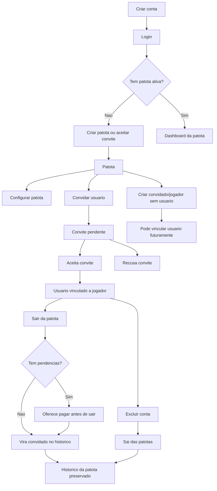

## 6. Configuracoes da patota

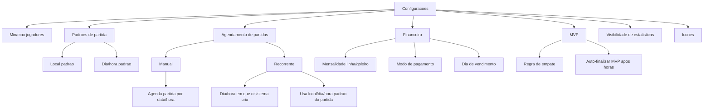

## 7. Fluxo de partida

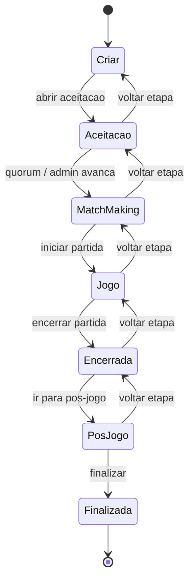

## 8. Detalhes da partida

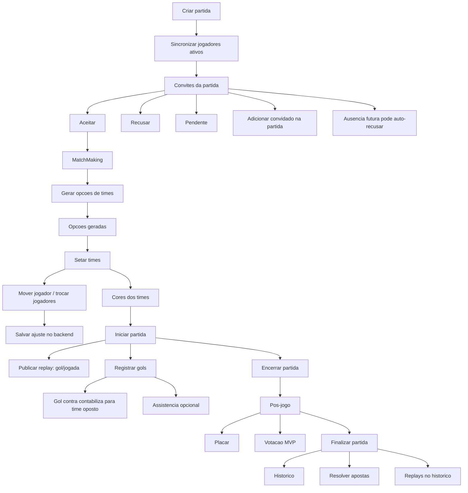

## 9. Votacoes e eventos

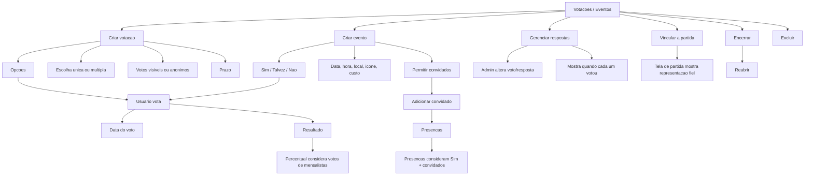

## 10. Financeiro

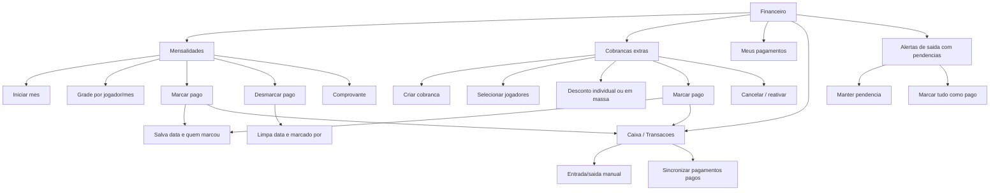

## 11. Calendario e ausencias

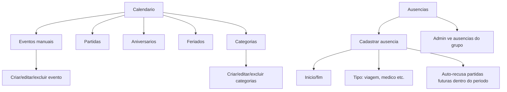

## 12. Historico, estatisticas e apostas

```mermaid
flowchart TD
    History["Historico"] --> MatchDetails["Detalhe da partida"]
    MatchDetails --> Score["Placar"]
    MatchDetails --> Lineup["Escalacao"]
    MatchDetails --> Goals["Gols"]
    MatchDetails --> Replays["Replays"]
    MatchDetails --> Mvp["Resultado MVP"]
    MatchDetails --> LinkedPoll["Votacao vinculada"]
    MatchDetails --> Simulation["Simulacao / linha do tempo"]

    Stats["Estatisticas"] --> VisualStats["Visual stats"]
    Stats --> PlayerHistory["Historico do jogador"]
    Stats --> Spotlight["Destaques"]
    Stats --> TeamBuilder["Montador/analisador de times"]

    Bets["Apostas"] --> BettableMatches["Partidas apostaveis"]
    Bets --> PlaceBet["Criar/alterar aposta"]
    Bets --> DeleteBet["Excluir aposta"]
    Bets --> Results["Resultado da aposta"]
    Bets --> Leaderboard["Ranking"]
    Bets --> Balance["Saldo"]
    Bets --> BetHistory["Historico de apostas"]

    MatchFinalized["Partida finalizada"] --> ResolveBets["Resolve apostas"]
    ResolveBets --> Results
    ResolveBets --> Balance
```

## 13. Replays

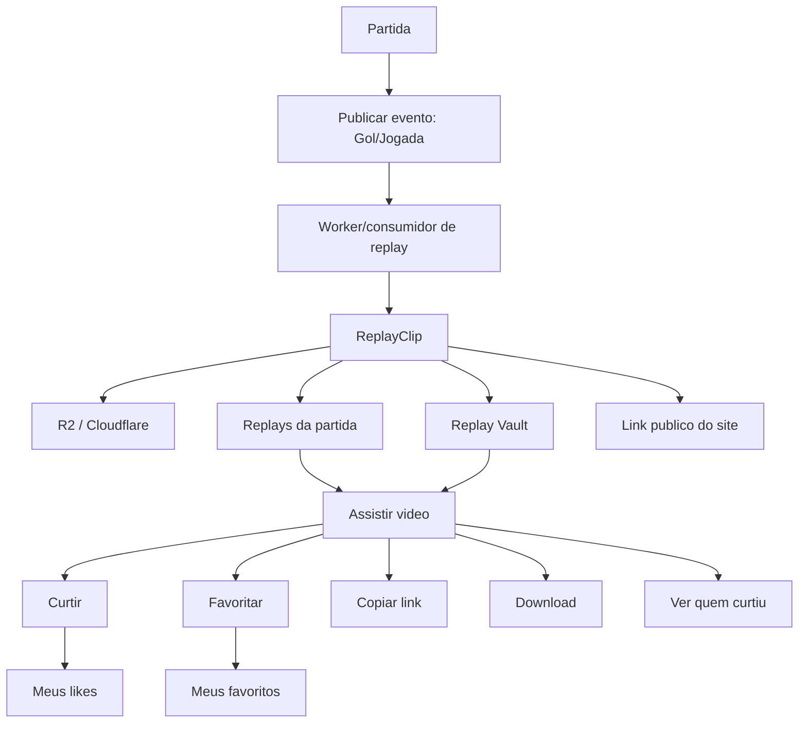

## 14. Notificacoes, realtime e jobs

```mermaid
flowchart TD
    Actions["Acoes do sistema"] --> Push["Push notifications"]
    Actions --> InApp["Notificacoes no app/site"]
    Actions --> Realtime["SignalR realtime"]
    Actions --> Scheduled["Jobs agendados"]

    Push --> Token["Push token do dispositivo"]
    InApp --> NotificationList["Lista de notificacoes"]
    NotificationList --> Read["Marcar lida"]
    NotificationList --> Delete["Excluir"]

    Realtime --> MatchChanged["match.changed"]
    Realtime --> PollChanged["poll.changed"]
    Realtime --> GroupChanged["group.changed"]

    Scheduled --> MatchReminders["Lembretes de partida"]
    Scheduled --> NoQuorum["Aviso sem quorum"]
    Scheduled --> MvpReminder["Lembrete MVP"]
    Scheduled --> MvpAutoFinalize["Auto-finalizar MVP"]
    Scheduled --> PollReminders["Lembretes de votacao/evento"]
    Scheduled --> PollAutoClose["Auto-encerrar votacao"]
    Scheduled --> CalendarReminders["Lembretes de calendario"]
    Scheduled --> MonthlyPaymentReminder["Lembrete mensalidade"]
    Scheduled --> BirthdayJob["Aniversarios"]
    Scheduled --> MatchScheduler["Criar partidas agendadas"]
    Scheduled --> ClipCleanup["Limpeza de clips"]
```

## 15. Relacionamento de entidades principais

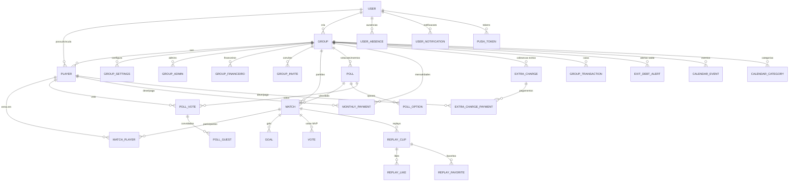

## 16. Jornada principal do usuario

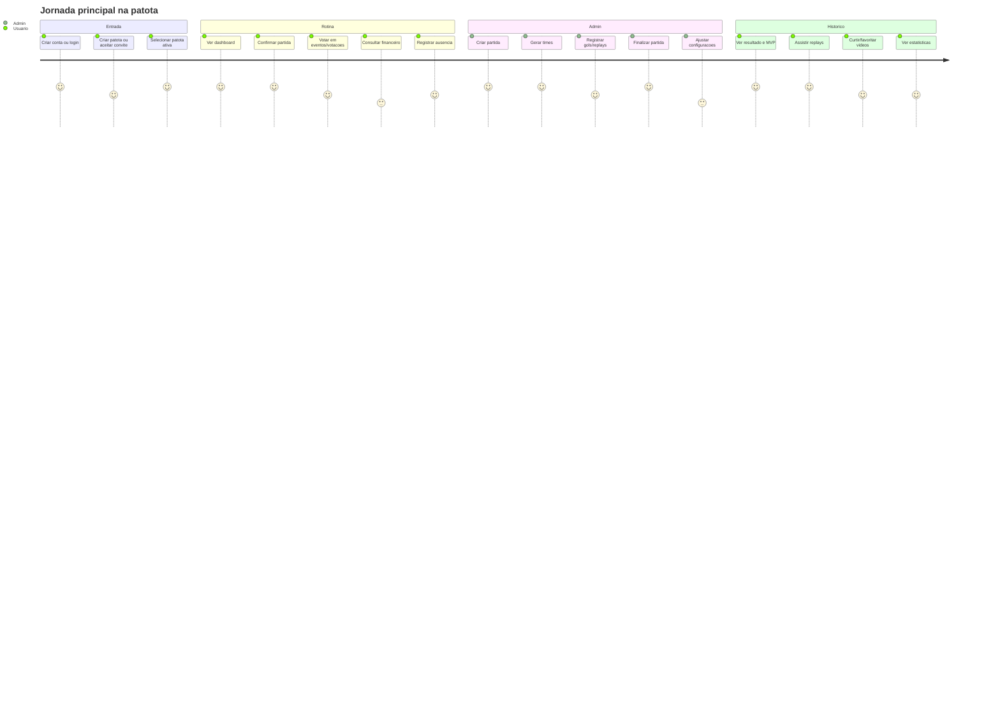
